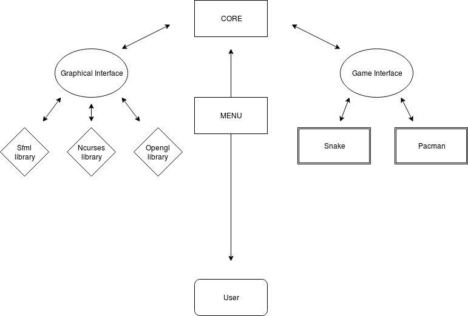

Arcade
======
Arcade Project is set of famous retro games:
- **Snake**
- **Pacman**


We implemented three different library for our games:
- **Ncurses**
- **Opengl**
- **Sfml**

To load the game and the graphics together, we used two different interfaces initialized in the core program:
- **IGraph** : graphical interface.
- **IGame** : game interface.

Those Interfaces implement function prototypes used by all the classes linked to them.

## Description of our program

[]


## Clone the project

To get our project you need to clone it by:
- clicking on `clone or download`
- copying the https
- On your terminal use `git clone` with the https and press enter.

## Install graphical libraries

Before compiling our project you need to install:
- The Ncurses library : `sudo apt-get install libncurses-dev`
- The Sfml library by installing : `sudo apt-get install g++ build-essential libpthread-stubs0-dev libgl1-mesa-dev libx11-dev libxrandr-dev libfreetype6-dev libglew-dev libjpeg-dev libsndfile1-dev libopenal-dev libsfml-dev`
- The OpenGl library : `sudo apt-get install freeglut3-dev`

## Create a dynamic library

To create a dynamic library you need to compile all your files with:
- `-shared` and `-fpic` flags.

```
g++ -shared -fPIC -o name_of_your_library your_file.cpp
```

Or do a `make arcade` at the root directory to compile all libraries and games at once.

## Launch game

To launch a game you need to do : `./arcade lib/~.so`
You choose the .so you want between ncurses, sfml and OpenGl in the lib directory.

## Graphical interface

Our graphical libraries are all linked to an interface, we called it `IGraph`.
To load the correct library, you need to:

```
IGraph *graph = new (name_of_the_library);
```

Use the `IGraph` pointer to call the graphical functions you need.

## Game interface

Our game libraries are also linked to an interface, we called it `IGame`.
To load the correct game, you need to:

```
IGame *game = new (name_of_the_game);
```

## Graphical Functions

### Create Window

Creates a window of size `ẁidth` * `height` and returns the dimension of the window.
```
std::pair<uint16_t, uint16_t>  create_window(uint16_t width, uint16_t height);
```
### Close Window

Closes the window.
 ```
  void close_window(void);
   ```

### Draw rectangle

Draws a bloc of color `color` and at the position `point`
```
void draw_rectangle(const arcade::Position &point, const t_a_color &color)
```

### Draw texte

Prints a string `text` of color `color` on the window at the position `point` with a size `size`
```
void  draw_text(const arcade::Position &point, const std::string &text, const size_t size, const t_a_color &color)
```

### Draw shape

Prints a vector of blocs at the position `point` of color `color`

```
void draw_shape(const std::vector<arcade::Position> &lpoint, const t_a_color &color);
```

### Clear Window

Clears the entire window.

```
void a_clear(void);
```

### Display window

Displays the changes made on the window.

```
void a_refresh(void);
```

### Is open

Checks if the window is open (returns a bool).

```
bool is_open(void) const;
```

### Check input

Checks and returns the users keyboard input.

```
virtual void draw_sprite(const arcade::Position &point, const t_drawer& draw, const std::string &path) = 0;
```

## Game functions

### Go functions

Moves the character in a new direction(changes thanks to the users *input* on the keyboard).

```
void change_direction(Input input);
void go_up(void);
void go_down(void);
void go_left(void);
void go_right(void);
```

### Play

Plays a round.

```
void play(IGraph &graph);
```

### Init

Initializes the game and window.

```
void init(uint16_t width, uint16_t height, const std::string &name);
```

### Get map

Translates map size (width and heigth) to moulinette format.

```
 const arcade::GetMap *get_map(void) const;
 ```

### WhereAmI

Translates the position of the character to moulinette format.

```
 const arcade::GetMap *get_map(void) const;
 ```

## Scores

To use the scores you need to declare an instance of the `Scores object` and call the member function `init`.
See `Init` function from `Game functions`.